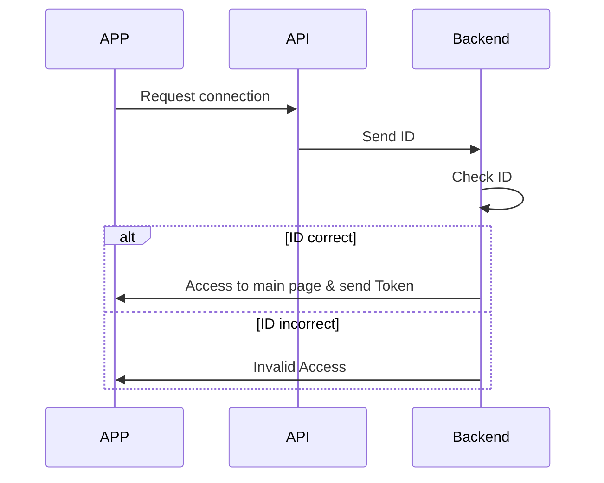

# FabApp
L'app mobile du fab



 ```mermaid
 %%{init: { 'logLevel': 'debug', 'theme': 'base', 'gitGraph': {'showBranches': false}}}%%
    gitGraph:
    commit id:"setup"
    branch qa
    checkout qa
    commit id:"first qa commit"
    branch dev
    checkout dev
    commit id:"first dev commit"
    branch feature_api
    checkout feature_api
    commit id:"first feature_api commit"


```
