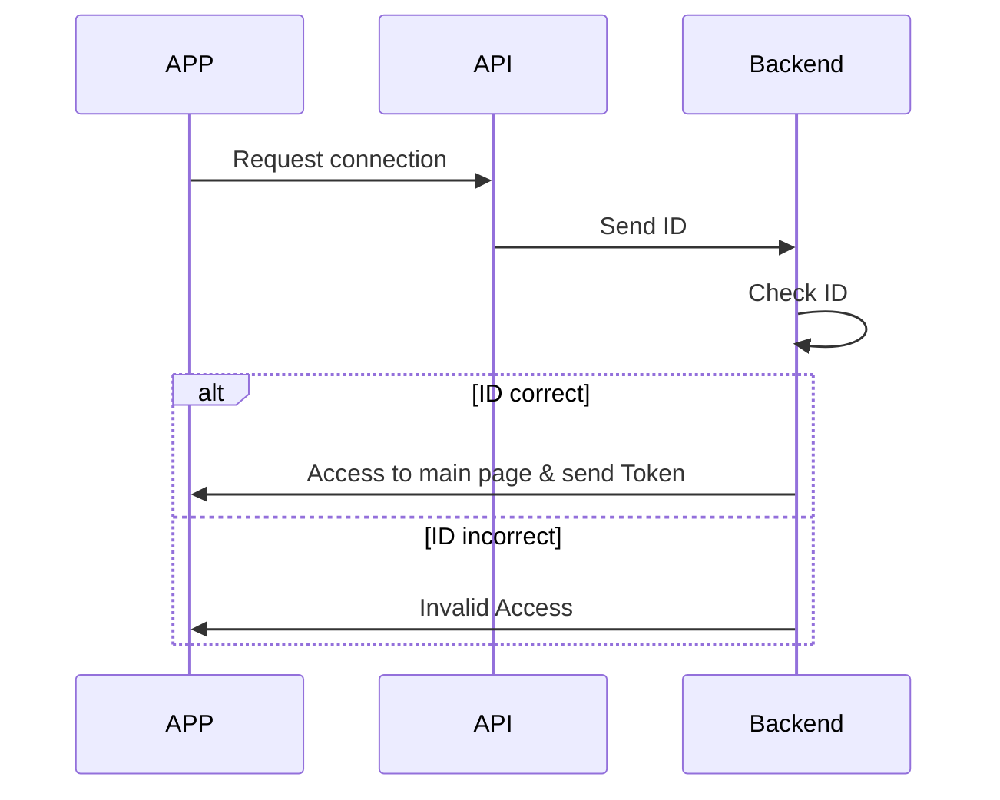

# FabApp
L'app mobile du fab



 ```mermaid
 %%{init: { 'logLevel': 'debug', 'theme': 'base', 'gitGraph': {'showBranches': false}}}%%
    gitGraph:
    commit id:"setup"
    commit id:"flutter setup"
    branch Developpement
    checkout Developpement
    commit id:"first dev commit"
    branch Test
    checkout Test
    commit id:"first test commit"
    commit id:"first API"
    checkout Developpement
    merge Test tag:"v0.1"
    
    checkout Test
    commit id:"First Page connection"
    commit id:"Chat Page"
    checkout Developpement
    merge Test tag:"v0.2"

    checkout main
    merge Developpement tag:"v1"


```

- faire transfert en json
--> structure interne type date de derniere update, bits de securité


design --> figma --> neomorphisme ou  glass
typo

